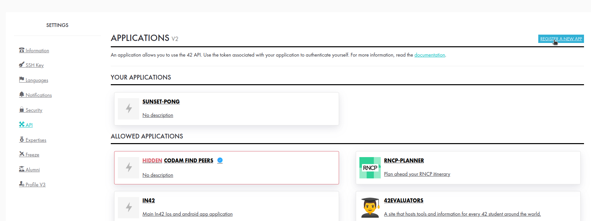
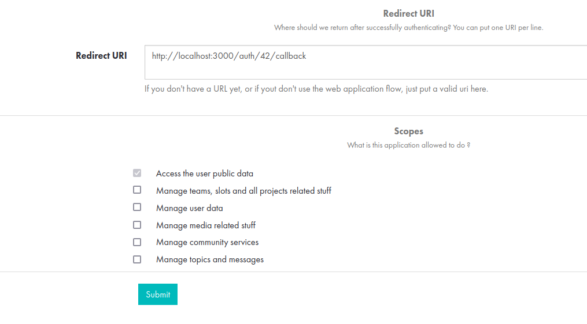

# 42 API Setup Guide

This guide explains how to set up the 42 API for use with the Online Friend Notifier.

## Steps

1. **Go to your 42 Intra profile:** [https://profile.intra.42.fr/]
2. **Navigate to "API Credentials":**

- settings

- API

- Give Redirect URI and submit

## Important Security Notes

* **Do not** commit your Client ID and Client Secret to your Git repository. ...
